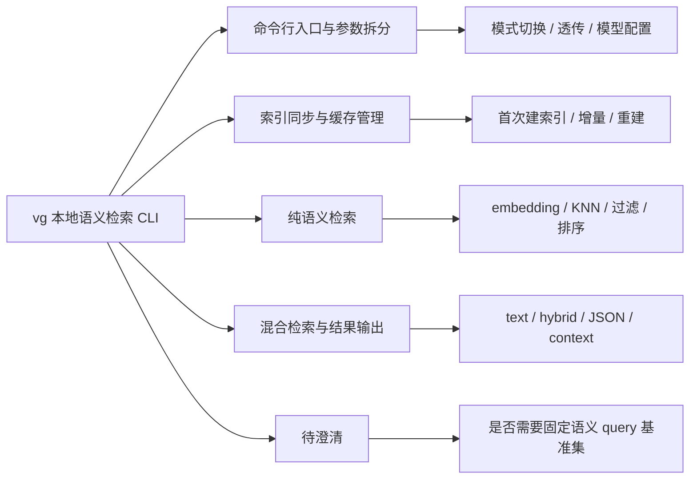

# 测试用例总览图

## 来源

- 需求文档：`docs/vg-tdd.md`、`.context/attachments/plan.md`
- 版本：`vg` MVP + Phase 2
- 评审目标：形成可执行的测试策略、模块级用例矩阵，以及 smoke/regression 清单

## 覆盖概览

- 核心模块：
  - 命令行入口与参数拆分
  - 索引同步与缓存管理
  - 纯语义检索
  - 混合检索与结果输出
- 核心角色：
  - CLI 用户
  - 本地维护者/开发者
- 核心状态：
  - 未索引
  - 已索引
  - 缓存命中
  - 缓存失效
  - 模型变更需重建
- 重点异常：
  - `rga` / `rga-preproc` 不可用
  - 模型维度不一致
  - 参数冲突或缺失
  - 文本提取失败
- 重点边界：
  - `top_k=1`
  - `threshold` 边界
  - 空结果
  - 路径作用域过滤
  - 已实现扩展参数的向后兼容

## Mermaid 总览图

## 模块图索引

| 文件 | 模块 | 覆盖范围 |
| --- | --- | --- |
| `module-01-cli-entry-and-args.md` | 命令行入口与参数拆分 | 模式切换、参数消费、透传、模型配置、错误参数 |
| `module-02-index-sync-and-cache.md` | 索引同步与缓存管理 | 首次建索引、增量更新、删除清理、重建、无缓存 |
| `module-03-semantic-search.md` | 纯语义检索 | query embedding、路径过滤、阈值、top_k、空结果 |
| `module-04-hybrid-output.md` | 混合检索与结果输出 | 文本侧解析、RRF 融合、终端输出、JSON 输出、context |

## 测试矩阵

- 测试矩阵已内嵌在各模块文档中。
- smoke / regression 清单见 `smoke-regression-checklist.md`。

## 评审结论

- 结论：`有条件通过`
- 是否允许进入 API/UI/Performance 生成：`不适用 API/UI，可进入后续性能与回归资产细化阶段`
- 备注：
  - 主链路与主要异常已可追踪
  - 当前唯一剩余待确认项是语义基准样例集
