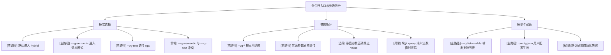

# 命令行入口与参数拆分

## 模块信息

- 模块名称：命令行入口与参数拆分
- 覆盖目标：验证 `vg` / `vg-index` 的入口行为、`--vg-*` 自消费规则、非 `--vg-*` 参数透传规则、帮助信息与模型配置读取
- 关键角色：CLI 用户、维护者
- 关键状态：默认 hybrid、纯文本、纯语义、索引专用、模型配置生效

## Mermaid 模块图

## 场景覆盖说明

| 场景 | 覆盖重点 | 备注 |
| --- | --- | --- |
| 模式选择 | `hybrid / semantic / text / indexer` 路由正确 | 入口级 smoke |
| 参数拆分 | `--vg-*` 与 `rga/rg` 参数不串味 | 需要兼顾带值参数 |
| 模型与帮助 | 配置读取、帮助/版本输出、错误路径 | `.config.json` 是模型配置事实来源 |

## 关键前置条件

- 本机已安装 `rga`、`rga-preproc`
- 当前工作目录存在可搜索夹具
- 默认缓存目录可写，或显式指定 `--vg-cache-path`

## 依赖与风险

- 参数解析是 best-effort，不保证覆盖所有 `rg` 短参数簇
- 默认只指向 `bge-small-zh`，其余模型和维度由用户在 `.config.json` 中配置

## 测试矩阵

| 场景 | 用例 ID | 用例标题 | 类型 | 前置条件 | 预期结果 | 自动化建议 | 备注 |
| --- | --- | --- | --- | --- | --- | --- | --- |
| 模式选择 | CLI-001 | 无模式参数时默认走 hybrid | 主路径 | 存在 query 和 path | 返回融合结果而非纯文本结果 | CLI smoke / Manual | 可对比输出条数与分值 |
| 模式选择 | CLI-002 | `--vg-semantic` 时只执行语义搜索 | 主路径 | 索引或可自动建索引 | 输出结果全部来自语义侧 | CLI smoke / Manual | 可配合 `--vg-json` 断言 `source=vector` |
| 模式选择 | CLI-003 | `--vg-text` 时完全透传到 `rga` | 主路径 | 本机有 `rga` | 输出与 `rga` 直接执行一致 | CLI smoke / Manual | 建议对同一 query 做 diff |
| 模式选择 | CLI-004 | `--vg-semantic` 与 `--vg-text` 同时传入 | 异常 | 无 | 立即报错并返回非 0 | CLI regression | 已有单元测试可扩展到二进制级 |
| 参数拆分 | CLI-005 | `--vg-top-k`、`--vg-threshold` 被本地消费 | 主路径 | 语义或 hybrid 模式 | 结果数量/阈值生效 | CLI regression | 断言 top_k 和 score 过滤 |
| 参数拆分 | CLI-006 | `--rga-adapters`、`-i` 等参数继续透传 | 主路径 | 文本侧命令可执行 | `rga` 行为受透传参数影响 | CLI regression | 对比大小写敏感行为 |
| 参数拆分 | CLI-007 | 带值参数不会被误识别成 query/path | 边界 | 使用 `-g "*.rs"` 等参数 | query/path 提取正确 | Unit / CLI regression | 当前解析边界重点 |
| 参数拆分 | CLI-008 | 非法数值参数报错 | 异常 | `--vg-top-k=abc` | 返回错误信息与非 0 | Unit / CLI regression | 包括 chunk size / threshold |
| 模型与帮助 | CLI-009 | `--vg-list-models` 正常输出 | 主路径 | 无 | 返回当前 `fastembed` 可解析模型列表 | CLI smoke | 输出与当前依赖版本一致 |
| 模型与帮助 | CLI-010 | `.config.json` 中的模型与维度配置生效 | 主路径 | 缓存目录下已写入用户配置 | CLI 按配置加载模型并使用对应维度 | CLI regression | 建议隔离临时 cache path |
| 模型与帮助 | CLI-011 | 帮助信息输出完整 | 边界 | `--help` | 输出 usage 且退出码为 0 | CLI smoke | 可做 snapshot |
| 模型与帮助 | CLI-012 | 配置目录不可写时默认配置初始化失败 | 权限 | 指向只读目录且不存在 `.config.json` | 返回明确错误 | Manual | 本地权限场景 |
