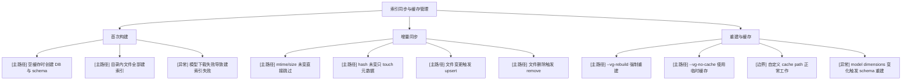

# 索引同步与缓存管理

## 模块信息

- 模块名称：索引同步与缓存管理
- 覆盖目标：验证首次建索引、增量更新、删除清理、缓存路径、基于 `.config.json` 的模型重建以及 no-cache 语义
- 关键角色：CLI 用户、维护者
- 关键状态：未索引、已索引、touch、upsert、remove、rebuild

## Mermaid 模块图

## 场景覆盖说明

| 场景 | 覆盖重点 | 备注 |
| --- | --- | --- |
| 首次构建 | DB/schema/model cache 创建 | 最关键 smoke |
| 增量同步 | unchanged / touch / upsert / remove 全路径 | 读时索引核心 |
| 重建与缓存 | rebuild/no-cache/cache-path/model change | 状态转换类用例 |

## 关键前置条件

- 使用独立临时目录作为 `--vg-cache-path`
- 准备可修改的夹具文件集
- 首次运行允许模型下载

## 依赖与风险

- `sqlite-vec` schema 与 `.config.json` 中的模型维度绑定，测试必须隔离缓存目录
- 并行预处理后落库仍串行，验证时不应只看速度，还要看一致性

## 测试矩阵

| 场景 | 用例 ID | 用例标题 | 类型 | 前置条件 | 预期结果 | 自动化建议 | 备注 |
| --- | --- | --- | --- | --- | --- | --- | --- |
| 首次构建 | IDX-001 | 空缓存首次执行 `vg-index` | 主路径 | 新临时 cache path | 创建 `.config.json`、`models/`、`index.sqlite3` | CLI smoke / Manual | 断言 stats 非 0 |
| 首次构建 | IDX-002 | 首次构建后 `--vg-index-stats` 可读 | 主路径 | IDX-001 完成 | 返回正确 `files_total/chunks_total` | CLI regression | 与夹具数量一致 |
| 首次构建 | IDX-003 | 模型下载失败时停止构建 | 异常 | 断网或禁用下载 | 返回错误，不写脏索引 | Manual | 网络依赖场景 |
| 增量同步 | IDX-004 | 未修改文件再次同步时命中 unchanged | 主路径 | 完成首次构建 | `files_indexed=0` 或仅少量 touch | CLI regression | 可重复执行 `vg-index` |
| 增量同步 | IDX-005 | 仅 mtime 变化但 hash 不变时只 touch | 边界 | 修改时间戳不改内容 | chunk_count 不变，索引不中断 | Manual | 需要脚本控制文件时间 |
| 增量同步 | IDX-006 | 文件内容变更触发 upsert | 主路径 | 修改夹具正文 | 搜索结果可反映新内容 | CLI regression | 回归语义与文本侧 |
| 增量同步 | IDX-007 | 删除文件触发 remove | 主路径 | 删除已索引文件 | stats 减少，搜索不再命中 | CLI regression | 需要临时副本目录 |
| 重建与缓存 | IDX-008 | `--vg-rebuild` 强制重建索引 | 主路径 | 已有旧索引 | schema 与内容按当前模型重建 | CLI smoke | 断言能正常重跑 |
| 重建与缓存 | IDX-009 | `--vg-no-cache` 使用临时目录 | 主路径 | 无 | 本次命令成功，默认缓存不被污染 | CLI regression | 适合 CI |
| 重建与缓存 | IDX-010 | `--vg-cache-path` 指向自定义目录 | 边界 | 指定可写目录 | 索引完全落在自定义路径 | CLI regression | |
| 重建与缓存 | IDX-011 | `.config.json` 中模型或维度变化时自动重建 | 异常 | 修改用户配置后的缓存目录 | 自动重建 schema，不残留错误表结构 | Manual / CLI regression | 已知高风险 |
