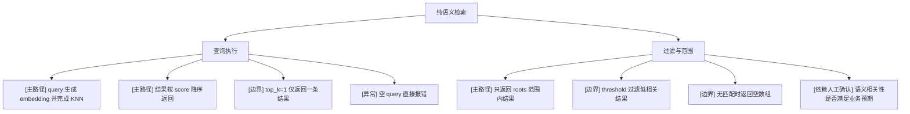

# 纯语义检索

## 模块信息

- 模块名称：纯语义检索
- 覆盖目标：验证 query embedding、KNN、路径过滤、阈值、top_k、空结果与语义相关性
- 关键角色：CLI 用户
- 关键状态：已索引、可搜索、空结果、受 threshold 过滤

## Mermaid 模块图

## 场景覆盖说明

| 场景 | 覆盖重点 | 备注 |
| --- | --- | --- |
| 查询执行 | embedding、KNN、排序 | 核心语义链路 |
| 过滤与范围 | path scope、threshold、空结果 | 正确性重点 |

## 关键前置条件

- 已完成至少一次成功建索引
- 存在具备语义相关性的夹具
- 模型缓存可读

## 依赖与风险

- 语义结果的“合理性”带主观性，需要人工确认样例集
- 当前 score 为 `1 / (1 + distance)`，需要保证测试断言用相对排序而不是固定绝对值

## 测试矩阵

| 场景 | 用例 ID | 用例标题 | 类型 | 前置条件 | 预期结果 | 自动化建议 | 备注 |
| --- | --- | --- | --- | --- | --- | --- | --- |
| 查询执行 | SEM-001 | `--vg-semantic` 正常返回相关结果 | 主路径 | 已索引夹具 | 返回至少 1 条语义命中 | CLI smoke | |
| 查询执行 | SEM-002 | 结果按 score 由高到低排序 | 主路径 | 返回多条结果 | 分数单调不升 | CLI regression | 用 `--vg-json` 断言 |
| 查询执行 | SEM-003 | `top_k=1` 时只返回 1 条 | 边界 | 相关结果 >1 | 结果条数为 1 | CLI regression | |
| 查询执行 | SEM-004 | 空 query 报错 | 异常 | `""` 或仅空白 | 返回非 0 与错误提示 | CLI regression | |
| 过滤与范围 | SEM-005 | 指定子目录时只返回该路径范围内结果 | 主路径 | 构造多目录夹具 | 结果路径均在 roots 下 | CLI regression | |
| 过滤与范围 | SEM-006 | 高 threshold 过滤弱相关结果 | 边界 | 设置较高阈值 | 结果数减少或为空 | CLI regression | |
| 过滤与范围 | SEM-007 | 无匹配时返回空结果集 | 边界 | 使用明显无关 query | JSON 结果数组为空，终端无命中 | CLI regression | |
| 过滤与范围 | SEM-008 | 中文 query 对中文文档具有基本相关性 | 依赖人工确认 | 中文夹具已索引 | 主要结果落在预期文档 | Manual | 推荐固定样例集 |
