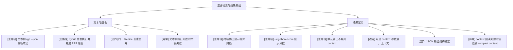

# 混合检索与结果输出

## 模块信息

- 模块名称：混合检索与结果输出
- 覆盖目标：验证文本侧 JSON 解析、hybrid 并发执行、RRF 融合、终端输出、JSON 输出、可选上下文展示
- 关键角色：CLI 用户
- 关键状态：text result、vector result、hybrid result、终端输出、JSON 输出

## Mermaid 模块图

## 场景覆盖说明

| 场景 | 覆盖重点 | 备注 |
| --- | --- | --- |
| 文本与融合 | 文本侧 JSON、RRF、去重、线程异常 | 默认模式主链路 |
| 结果渲染 | relative path、score、默认紧凑输出、可选 context、JSON 稳定性 | 用户体验重点 |

## 关键前置条件

- 夹具中同时存在文本可命中项与语义相关项
- `rga` 可执行
- 当前目录位于项目根目录，便于断言相对路径显示

## 依赖与风险

- 文本侧命中与向量侧命中混合时，排序受权重影响，需要明确“接受排序区间”而非只认单一第一名
- `--vg-context` 为已实现扩展项，不属于需求基线
- 该参数只影响终端输出，不扩展 JSON 结构

## 测试矩阵

| 场景 | 用例 ID | 用例标题 | 类型 | 前置条件 | 预期结果 | 自动化建议 | 备注 |
| --- | --- | --- | --- | --- | --- | --- | --- |
| 文本与融合 | HYB-001 | 默认模式返回 hybrid 结果 | 主路径 | 同时存在文本与语义命中 | 返回融合后结果集 | CLI smoke | |
| 文本与融合 | HYB-002 | 文本侧 JSON 解析后 line/path 正确 | 主路径 | 文本 query 可命中 | 路径、行号正确映射 | CLI regression | |
| 文本与融合 | HYB-003 | 同一 file:line 的 text/vector 结果被合并 | 边界 | 构造同时命中的样例 | 最终结果去重 | CLI regression | 重点验证绝对/相对路径归一化 |
| 文本与融合 | HYB-004 | 文本侧执行失败时返回错误 | 异常 | 临时屏蔽 `rga` | 命令失败，不返回伪结果 | Manual | |
| 结果渲染 | OUT-001 | 终端输出显示相对路径 | 主路径 | 在仓库根目录运行 | 输出路径不带仓库绝对前缀 | CLI regression | |
| 结果渲染 | OUT-002 | `--vg-show-score` 显示 score | 主路径 | 指定该参数 | 每条结果带 score | CLI smoke | |
| 结果渲染 | OUT-003 | 默认终端输出不展开上下文 | 主路径 | 不传 `--vg-context` | 输出为紧凑命中内容，不自动回读上下文块 | CLI regression | 非基线扩展默认关闭 |
| 结果渲染 | OUT-004 | `--vg-context=1` 展开上下文 | 边界 | 文本文件可回读 | 输出包含上下文行和命中标记 | CLI regression | 已实现扩展项 |
| 结果渲染 | OUT-005 | `--vg-json` 输出结构稳定 | 边界 | 使用 JSON 模式 | 包含 `results` 与 `stats`，字段完整 | CLI regression | 建议 snapshot |
| 结果渲染 | OUT-006 | context 回读失败时回退为 compact content | 异常 | 构造不可回读文件 | 终端仍能输出结果，不 panic | Manual / regression | |
